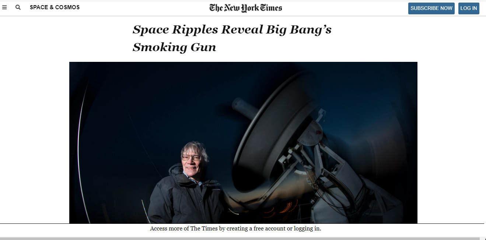

# NYT-Clone

> This project consists of building an HTML document that matches the appearance of New york times [Article](https://www.nytimes.com/2014/03/18/science/space/detection-of-waves-in-space-buttresses-landmark-theory-of-big-bang.html?_r=0).

## Project Requirements
- The project is meant to demonstrate 
- position and floating of elements.
- The box model
- Working with forms (buttons in this case)
- Embedding images

### Images
- It has embedded Images placed on articles
- It has thumbnails
- Images have caption or Links providing a short description

### Video 
- It has an embedded Video and is able to play.
- The video has a caption 

### Sidebar 
- Has two sidebars

## Built With

- HTML
- CSS

## Live Demo

[Live Demo Link](https://delicelydia.github.io/NYT-Clone/index.html)

## Authors

👤 **Author1**

- Github: [@DeliceLydia](https://github.com/DeliceLydia)
- Twitter: [@IngabireLydia3](https://twitter.com/IngabireLydia)
- Linkedin: [Delice Lydia](https://www.linkedin.com/in/delice-lydia-91b55b167/)

👤 **Author2**

- Github: [@Lichapa](https://github.com/Lichapa)
- Linkedin: [mphatsolichapa](https://www.linkedin.com/in/mphatsolichapa/)

## Show your support

Give a ⭐️ if you like this project!